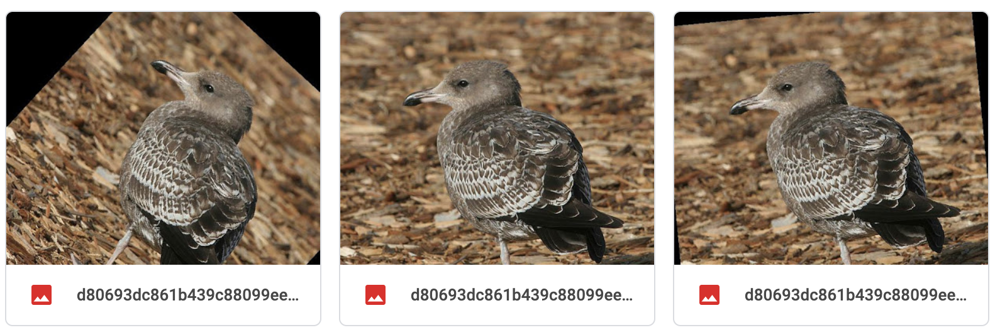
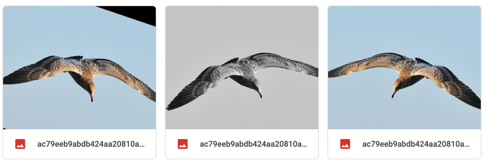
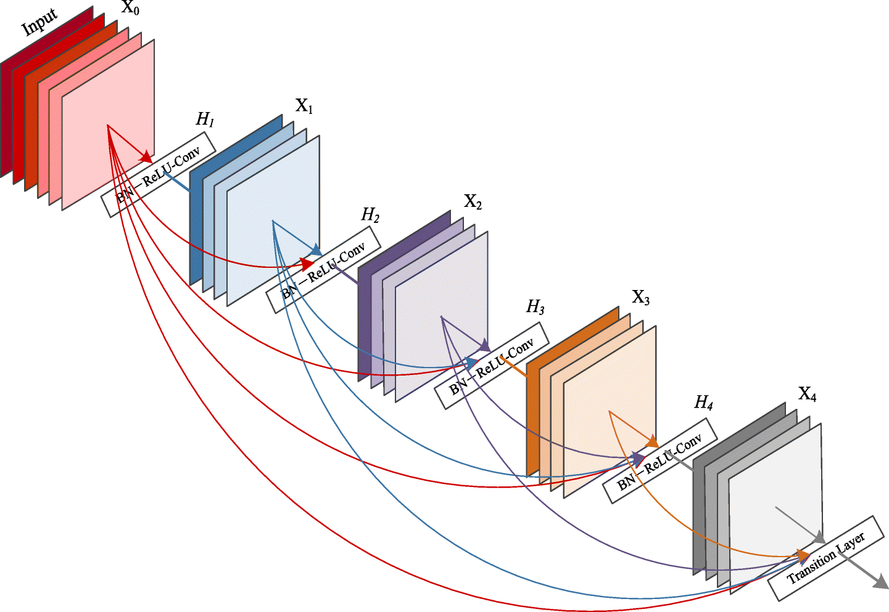
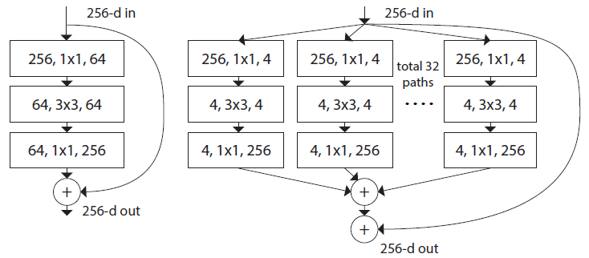
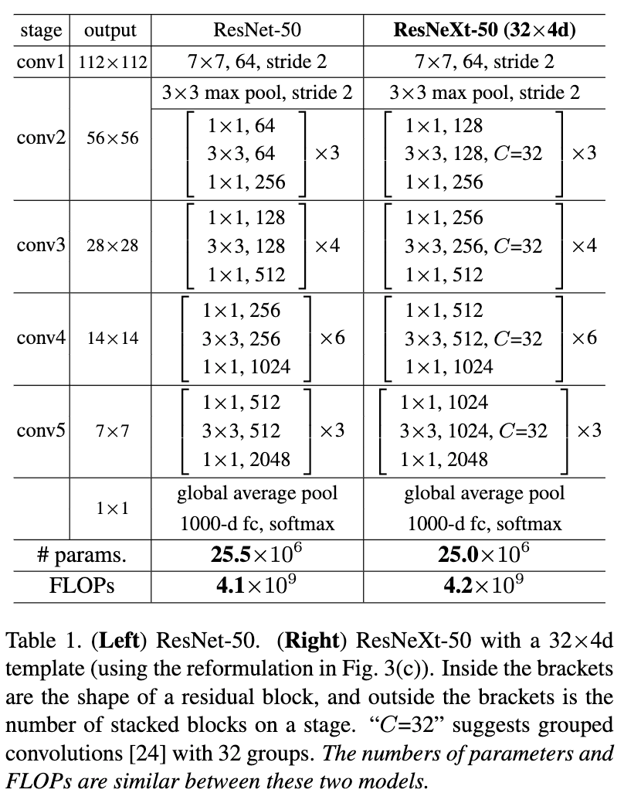
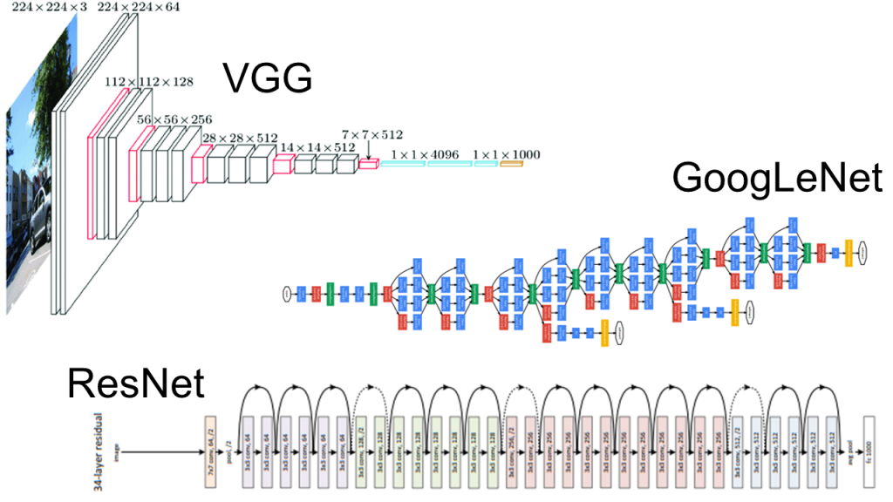

## Team:Tweety
### Members: 
Conrad Ciszek, Amir Mola, Jose Becerra, Tejas Bharadwaj

## About the project/competition: 
For our project we decided to use the Kaggle competition about classifying various bird categories. Given 555 different categories of birds, the challenge is to train a supervised machine learning model that is able to detect the category/class of a given image of a bird. The dataset contains about ~38000 images distributed unevenly between the 555 classes. Furthermore, there is not a unique image size for the training data and each image comes in a different dimension. These images are taken from birds in various geographical locations (land, tree, air) with the bird either flying or sitting still.

Our first approach to this problem was to use Transfer Learning to have a better shot at tackling this problem than starting from scratch. After reading a bit more on Pytorch pretrained models and looking at some examples and considering the resources (GPU) and time we have, we decided to work on training resnet50 as our base model. After 15 epochs and before the model starts overfitting, we got around 50% accuracy on the test data on the Kaggle competition which is not super good. Therefore, we decided to focus a bit more on balancing the training data first before starting to fine-tune anymore models.

## Upsampling:
To help boost accuracy of our model and account for overfitting we incorporated a technique called upsampling. Here we went through all the files of the 555 different birds and found the maximum number of images in each folder (106). By taking advantage of the Transforms library in Pytorch, we generated transformed images based on the existing images to increase the number of bird images in each class to the maximum number we got in the previous step. This approach was mainly done to ensure that we have the same number of images in each category and our data is balanced. Some transformations we utilized were random choices of: a horizontal flip, random rotation, and a random grayscale of an image. We did this in hopes of generating more useful data for the model to boost accuracy. Some examples of these transformations can be seen below: 
```
transforms.Compose([
   transforms.RandomChoice([
   transforms.RandomHorizontalFlip(),
   transforms.RandomRotation(degrees=45),
   transforms.RandomGrayscale(p=0.2),
   ])
```


## More PreTrained Models:
After balancing the data, we decided to return to fine-tuning pre-trained models to improve our accuracy. After reading more about Pytorch pretrained models, we decided to try resnet151, Densenet169, resNext and vgg_bn19. We trained each of these models separately with the new balanced training data and our accuracy results are as follows:

| Model           | Accuracy |
| GoogLeNet       | 0.410    |
| resnet 151      | 0.683    |  
| densenet 169    | 0.776    | 
| vgg_bn19        | 0.693    |
| resNext         | 0.735    |
| Output Stacking | 0.664    |
| Ensembling      | 0.831    |

As you can see our densenet169 model gives the best performance on the test data provided. However, as we can see in the table, other models are performing around the same ballpark and we were curious what would happen if we somehow combined the output of these models to achieve better accuracy. In the next experiment, we will discuss two interesting ideas that we tried (Ensembling and Output Stacking) and their results.

<center>DenseNet</center>

<center>resNext</center>


<center>VGG, GoogLeNet, and ResNet</center>

## Output Stacking:
Now that we have tried training 4 different models, we wanted to see what would happen if we train these models at the same time and instead of changing the output dimension of the last layer of each model to 555, we create our own fully connected layer. In other words, we initialized three models (resnet151, densenet169, vgg_bn19) and in our forward method, we ran each batch of input through each model separately and stacked the outputs and passed it to a fully connected layer that we constructed. For purposes of this experiment, our FC layer takes a tensor of size 3000 and outputs a tensor of 555. Our original thoughts were that this way, we can capture various features explored by all of these models, rather than just 1 and train our FC model to be able to correlate these features to one of the 555 classes. Unfortunately, after training this model, we saw that it easily overfits on the training data and we are not able to get an accuracy above 0.664. This could be due to the fact that our models are now capturing too much information and therefore, are overfitting faster to the training data and cannot reason about test data very well. 

## Ensembling:
Surprised by the overfitting of the previous method, we decided to still use multiple models for inference but instead of stacking their outputs, we simply take the average of their outputs. In other words, for each given image, we get the output tensor of size 555 from 3 models (resnet151, densenet169, resnext) and then take the average of those 3 tensors. This way each of these models' probability is contributing equally to the final probability tensor, which we take the max and determine the class of the given image. Using this method, we arrived at our all time best accuracy of 0.831. Unfortunately we were not able to improve upon this accuracy no matter which model or additional methods we proposed.

## Conclusion:
What we learned during this project is that machine learning with images takes a lot of time and a lot of computing power. We were primarily using colab for most of the project and started to hit walls with the gpu times. We learned about utilizing various techniques such as upsamples and ensembling as described above. For a few of us it was our first time using Pytorch as well which was an interesting experience. 
	During this project we also ran into some problems. There was the issue of running out of gpu computing time on colab and super long runtimes. To resolve this we had one of our group mates ssh into the CSE servers and utilize their GPUs. Another issue we had was when our model was trying to read a blank image. We believe this came from the transformations not executing correctly with one of the images. Removing that image resolved this issue. An image of the error can be seen below.

